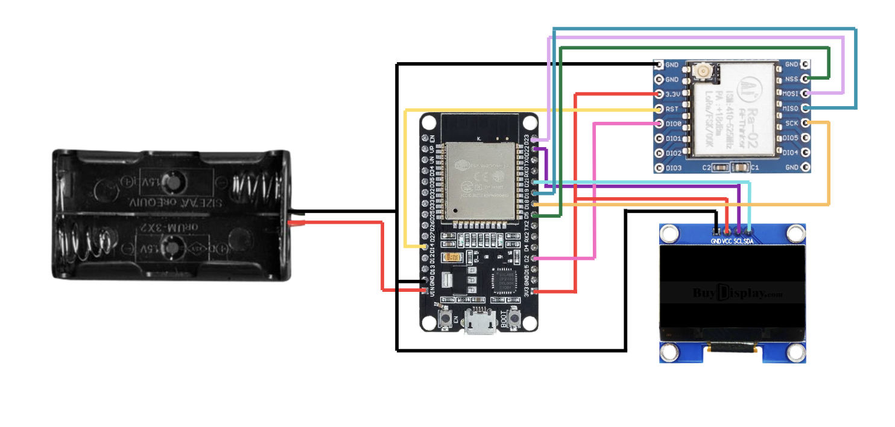

# ESP32 LoRa Sender/Receiver

This project uses ESP32 with LoRa (Ra-02) module and OLED display for wireless communication.

## Circuit Diagram



## Components

- ESP32 DevKit V1
- LoRa Ra-02 Module (SX1278, 433MHz)
- OLED Display 1.3" SH1106 (I2C)
- 2x 18650 Battery Holder

## GPIO Pin Connections

### LoRa Module (Ra-02) - SPI

| LoRa Pin | ESP32 GPIO | Description |
|----------|------------|-------------|
| VCC      | 3.3V       | Power (3.3V only!) |
| GND      | GND        | Ground |
| NSS (CS) | GPIO 5     | SPI Chip Select |
| RST      | GPIO 14    | Reset |
| DIO0     | GPIO 2     | Interrupt |
| MOSI     | GPIO 23    | SPI Data Out |
| MISO     | GPIO 19    | SPI Data In |
| SCK      | GPIO 18    | SPI Clock |

### OLED Display (SH1106) - I2C

| OLED Pin | ESP32 GPIO | Description |
|----------|------------|-------------|
| VCC      | 3.3V       | Power |
| GND      | GND        | Ground |
| SDA      | GPIO 21    | I2C Data |
| SCL      | GPIO 22    | I2C Clock |

### Power

| Source | ESP32 Pin | Description |
|--------|-----------|-------------|
| Battery + | VIN     | 3.7V - 7V input |
| Battery - | GND     | Ground |

## Libraries Required

Install these libraries via Arduino IDE Library Manager:

- `LoRa` by Sandeep Mistry
- `Adafruit GFX Library`
- `Adafruit SH110X`
- `NTPClient` (for sender only)

## Configuration

### Sender (`sender/sender.ino`)

1. Set your WiFi credentials:
   ```cpp
   const char* ssid = "YOUR_WIFI_SSID";
   const char* password = "YOUR_WIFI_PASSWORD";
   ```

2. Adjust timezone offset (default UTC+8):
   ```cpp
   NTPClient timeClient(ntpUDP, "pool.ntp.org", 28800, 60000);
   // 28800 = 8 hours * 3600 seconds
   ```

3. Adjust LoRa frequency for your region:
   ```cpp
   LoRa.begin(433E6);  // 433MHz for Asia
   // 868E6 for Europe
   // 915E6 for North America
   ```

### Receiver (`receiver/receiver.ino`)

1. Adjust connection timeout if needed:
   ```cpp
   #define CONNECTION_TIMEOUT 15000  // 15 seconds
   ```

2. Match the LoRa frequency with sender.

## Usage

1. Upload `sender/sender.ino` to the sender ESP32
2. Upload `receiver/receiver.ino` to the receiver ESP32
3. Sender will connect to WiFi, sync time via NTP, and transmit packets every 10 seconds
4. Receiver displays connection status, timestamp, and RSSI signal strength
